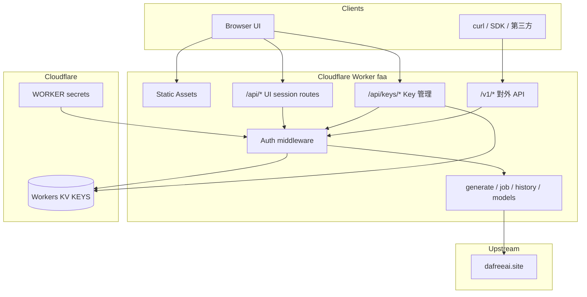

# DaFreeAi Studio — API 輸出 + API KEY 完整方案

> 目標：在現有 Cloudflare Worker（`faa.kinai.workers.dev`）上，提供  
> 1) **API Key 管理 UI**  
> 2) **對外標準 v1 API**（腳本 / 第三方可呼叫）  
> 3) **文件與範例**  
> 並保留現有瀏覽器 UI（localStorage 憑證）流程。

---

## 0. 現況與問題背景

### 現況
- Worker + Assets 已穩定：`/api/*` 由 [`cf/src/index.js`](cf/src/index.js) 處理
- 瀏覽器 UI 用 `X-User-Id` / `X-User-Token` 呼叫自家 API
- Worker 再代理到 `https://www.dafreeai.site`
- **沒有**對外 API Key、沒有標準 v1 契約、沒有 Key 管理 UI

### 上游模型限制（與本方案並行處理）
| 模型 | 觀察 |
|---|---|
| `nano-banana-2-lite` | 最穩定 unlimited，建議預設 |
| `gpt-image-2` | 有時成功；可能 `MODEL_NOT_ALLOWED_ON_UNLIMITED_PACKAGE` 或 `locked`（pool credits=0 / 帳號池） |
| `seedream-5.0-pro` / 多數非 unlimited | 常 `locked` 或需 tag / 非 unlimited package |
| 並發 | 同時只能 1 個 generation |

→ 前端預設模型與錯誤提示需一併修正（見 §8）。

---

## 1. 目標架構



### 雙認證模式

| 模式 | 誰用 | 憑證 | 用途 |
|---|---|---|---|
| **Session（現有）** | 瀏覽器 UI | `X-User-Id` + `X-User-Token`（localStorage） | 登入、生成 UI、**建立/撤銷 API Key** |
| **API Key（新增）** | 腳本 / 第三方 | `Authorization: Bearer faa_sk_...` | 呼叫 `/v1/*` 生成與查詢 |

**原則：API Key 綁定一份 dafreeai 憑證（userId+token）。**  
建立 Key 時，把當前登入的 dafreeai 憑證加密存入 KV；之後外部只帶 Key，Worker 還原憑證再打上游。

---

## 2. API Key 設計

### 2.1 Key 格式
```
faa_sk_<22-char-urlsafe-random>
```
- 前綴方便辨識與掃描
- 明文 **只在建立當下回傳一次**
- 儲存只存 `keyHash = SHA-256(key)`（hex）

### 2.2 KV 資料模型

**Namespace binding：** `KEYS`（Workers KV）

#### A) Key 主記錄
```
key: key:{keyHash}
value: {
  "id": "key_01H...",
  "name": "my-script",
  "userId": "1266...",
  "username": "kines966176",
  "tokenEnc": "<base64 aes-gcm ciphertext of dafreeai token>",
  "scopes": ["generate", "history", "models"],
  "createdAt": 1784910000000,
  "lastUsedAt": null,
  "revokedAt": null,
  "prefix": "faa_sk_ab12",
  "meta": { "note": "optional" }
}
```

#### B) 使用者索引（列出自己的 keys）
```
key: userkeys:{userId}
value: ["keyHash1", "keyHash2", ...]
```

#### C) 可選：限流計數
```
key: rl:{keyId}:{yyyyMMddHH}
value: count
```

### 2.3 加密
- Secret：`TOKEN_ENC_KEY`（32-byte，wrangler secret）
- 演算法：AES-GCM
- 只加密 **dafreeai token**；userId 可明文（方便除錯與索引）
- 日誌禁止印出 token / 完整 API key

### 2.4 Scopes（第一版）
| scope | 允許 |
|---|---|
| `generate` | `POST /v1/generate` |
| `jobs` | `GET /v1/jobs/:id` |
| `history` | `GET /v1/history` |
| `models` | `GET /v1/models` |
| `*` | 全部（預設） |

第一版預設 `["*"]`，UI 可勾選縮小。

### 2.5 生命週期
1. 使用者在 UI 登入（localStorage 憑證）
2. `POST /api/keys` 建立 → 回傳 **明文 key 一次**
3. 外部用 Bearer 呼叫 `/v1/*`
4. `DELETE /api/keys/:id` 撤銷（寫 `revokedAt`，從索引移除或標記）
5. 可選：`POST /api/keys/:id/rotate`（撤銷舊 + 建新）

---

## 3. 對外 v1 API 契約

Base URL：
```
https://faa.kinai.workers.dev
```

Auth header：
```
Authorization: Bearer faa_sk_...
```
（相容：`X-Api-Key: faa_sk_...`）

### 3.1 `GET /v1/models`
列出可用模型（與現有 catalog 相同，含 unlimited / notes）。

```json
{
  "ok": true,
  "models": [
    {
      "id": "nano-banana-2-lite",
      "name": "Nano Banana 2 Lite",
      "type": "image",
      "unlimited": true,
      "supported_resolutions": ["1K"],
      "notes": "Recommended default for unlimited package"
    }
  ]
}
```

### 3.2 `POST /v1/generate`
非阻塞提交（與現有 Phase 1 一致）。

Request：
```json
{
  "prompt": "卡卡西,Q版",
  "model": "nano-banana-2-lite",
  "aspect": "1:1",
  "resolution": "1K",
  "quality": "low",
  "duration": 5,
  "audio": true,
  "imagePaths": [],
  "chatId": null
}
```

Success `202`：
```json
{
  "ok": true,
  "status": "submitted",
  "jobId": "uuid-chat-id",
  "chatId": "uuid-chat-id",
  "model": "nano-banana-2-lite",
  "type": "image",
  "bananaCost": 0,
  "balance": 40,
  "poll": {
    "url": "/v1/jobs/uuid-chat-id",
    "intervalSec": 3,
    "timeoutSec": 180
  }
}
```

Error 範例：
```json
{
  "ok": false,
  "error": {
    "code": "MODEL_NOT_ALLOWED_ON_UNLIMITED_PACKAGE",
    "message": "Generation failed: MODEL_NOT_ALLOWED_ON_UNLIMITED_PACKAGE",
    "hint": "請改用 nano-banana-2-lite，或降低 quality / 確認帳號 package"
  }
}
```

### 3.3 `GET /v1/jobs/:jobId`
輪詢結果。

```json
{
  "ok": true,
  "status": "completed",
  "jobId": "...",
  "chatId": "...",
  "mediaUrl": "https://www.dafreeai.site/api/images/...",
  "media": "/api/images/...",
  "modelName": "nano-banana-2-lite",
  "resolution": "1K",
  "ratio": "1:1",
  "error": null
}
```

`status`：`pending` | `processing` | `completed` | `error` | `timeout`（client 側）

### 3.4 `GET /v1/history?limit=&offset=`
標準化 rows（與 UI history 類似）。

### 3.5 `GET /v1/me`
```json
{
  "ok": true,
  "userId": "1266...",
  "username": "...",
  "balance": 40,
  "tag": { "hasTag": true, "tagText": "DFAI" },
  "key": { "id": "key_...", "name": "my-script", "scopes": ["*"] }
}
```

### 3.6 錯誤碼正規化
| code | HTTP | 說明 |
|---|---|---|
| `UNAUTHORIZED` | 401 | 缺/錯 Key 或 session |
| `FORBIDDEN` | 403 | scope 不足 / key 已撤銷 |
| `VALIDATION_ERROR` | 400 | 參數錯誤 |
| `RATE_LIMITED` | 429 | 超限 |
| `UPSTREAM_BUSY` | 409 | Generation in progress |
| `MODEL_LOCKED` | 503 | All accounts inactive / locked |
| `MODEL_NOT_ALLOWED` | 403 | MODEL_NOT_ALLOWED_ON_UNLIMITED_PACKAGE |
| `UPSTREAM_ERROR` | 502 | 其他上游錯誤 |

Worker 解析上游 `error` 字串 → 對應 code + 中文 hint。

---

## 4. Key 管理 API（需 Session，非 API Key）

僅允許 `X-User-Id` + `X-User-Token`（與 UI 相同）。

| Method | Path | 說明 |
|---|---|---|
| `GET` | `/api/keys` | 列出目前使用者的 keys（**不含明文**，只 prefix + meta） |
| `POST` | `/api/keys` | 建立 key；body: `{ name, scopes? }`；**回傳一次明文** |
| `DELETE` | `/api/keys/:id` | 撤銷 |
| `POST` | `/api/keys/:id/rotate` | 可選：輪替 |

### 建立回應（唯一含明文）
```json
{
  "ok": true,
  "key": {
    "id": "key_01H...",
    "name": "my-script",
    "apiKey": "faa_sk_xxxxxxxxxxxxxxxxxxxx",
    "prefix": "faa_sk_xxxx",
    "scopes": ["*"],
    "createdAt": 1784910000000,
    "warning": "請立即複製保存，之後無法再查看完整 key"
  }
}
```

### 列表回應
```json
{
  "ok": true,
  "keys": [
    {
      "id": "key_01H...",
      "name": "my-script",
      "prefix": "faa_sk_xxxx",
      "scopes": ["*"],
      "createdAt": 1784910000000,
      "lastUsedAt": 1784911000000,
      "revokedAt": null
    }
  ]
}
```

---

## 5. UI 變更

### 5.1 新分頁「API」
位置：現有 tabs 旁（登入 / 生成 / 歷史 / 狀態 / **API**）

內容：
1. **說明**：如何用 API Key 呼叫 `/v1/*`
2. **建立 Key**：名稱 + 建立按鈕
3. **明文顯示區**（建立後一次性，可複製）
4. **Key 列表**：prefix、建立時間、最後使用、撤銷
5. **快速範例**（curl 區塊，可一鍵複製）

### 5.2 生成分頁小改進（並行）
- 預設模型固定 `nano-banana-2-lite`
- 模型選項標註 `recommended` / `may lock` / `tag required`
- 錯誤 `MODEL_NOT_ALLOWED...` / `locked` 顯示可讀中文 + 建議改模型

### 5.3 文件入口
- Footer 或 API 分頁連到 `/docs` 或 GitHub `docs/v1-api.md`
- 可選：靜態頁 `cf/public/docs.html`（Phase 內做簡易版）

---

## 6. 實作模組切分

```
cf/
  src/
    index.js              # 路由：/api/* + /v1/* + /api/keys/*
    routes.js             # 既有 UI API
    routes-v1.js          # 新增 v1 handlers
    routes-keys.js        # 新增 key 管理 handlers
  functions/_shared/
    http.js               # 擴充：extractApiKey, requireScope, normalizeError
    client.js             # 既有上游 client
    models.js             # 更新 notes / recommended
    keys.js               # 新增：hash/create/list/revoke/resolve
    crypto.js             # 新增：AES-GCM encrypt/decrypt
    errors.js             # 新增：上游錯誤 → 標準 code
  public/
    index.html            # + API tab
    js/app.js             # + key UI + 錯誤提示 + 預設模型
    css/style.css         # 小幅樣式
    docs.html             # 可選簡易文件頁
docs/
  v1-api.md               # 完整 API 文件
  examples/
    curl.sh
    generate.mjs
wrangler.toml / cf/wrangler.toml
  + [[kv_namespaces]] binding = "KEYS"
  + secret TOKEN_ENC_KEY
```

### 路由表（index.js 新增）

| Method | Path | Handler |
|---|---|---|
| GET/POST/DELETE | `/api/keys`… | routes-keys |
| GET | `/v1/models` | routes-v1 |
| POST | `/v1/generate` | routes-v1 |
| GET | `/v1/jobs/:id` | routes-v1 |
| GET | `/v1/history` | routes-v1 |
| GET | `/v1/me` | routes-v1 |

**相容性：** 現有 `/api/generate` 等 **保留**，UI 不破壞。

---

## 7. 安全與限流

### 必須
1. API Key 只存 hash
2. dafreeai token AES-GCM 加密
3. 撤銷立即生效
4. CORS：`/v1/*` 可開 `*` 或可設定 `ALLOWED_ORIGINS`；敏感管理路由維持同源
5. 不 log 完整 key / token

### 建議第一版限流
- 每 key：`30 req/min`（generate 另限 `6/min`）
- 並發：上游本身只允許 1 個 generation → 回 `409 UPSTREAM_BUSY`

### 可選進階（後續）
- Key 過期時間
- IP allowlist
- 用量統計 dashboard
- Webhook 完成通知（需 queue）

---

## 8. 模型 UX 修正（與 API 方案一併做）

更新 [`cf/functions/_shared/models.js`](cf/functions/_shared/models.js)：

| id | 調整 |
|---|---|
| `nano-banana-2-lite` | `recommended: true`，notes 強調 unlimited 預設 |
| `gpt-image-2` | notes：可能 intermittent lock / package 拒絕；建議 quality=low |
| `seedream-5.0-pro` 等 | notes：常 locked / 需 tag / 非 unlimited |

前端：
- `fillModels()` 排序：recommended 在前
- 錯誤映射中文提示

---

## 9. 設定與部署步驟

### 9.1 建立 KV
```bash
npx wrangler kv namespace create KEYS
npx wrangler kv namespace create KEYS --preview
```
把 id 寫入 root + `cf/wrangler.toml`：
```toml
[[kv_namespaces]]
binding = "KEYS"
id = "<id>"
preview_id = "<preview_id>"
```

### 9.2 Secret
```bash
# 32-byte hex 或 base64
npx wrangler secret put TOKEN_ENC_KEY
```

### 9.3 部署
- 改 root `wrangler.toml`（Git auto-deploy 會吃這個）
- 同步 `cf/wrangler.toml`
- 推 GitHub → 等 auto-deploy
- 驗證：
  - `/api/__version` 新 build
  - UI 建立 key
  - `curl -H "Authorization: Bearer faa_sk_..." /v1/models`
  - `POST /v1/generate` + poll `/v1/jobs/:id`

---

## 10. 文件交付物

| 檔案 | 內容 |
|---|---|
| `docs/v1-api.md` | 完整 REST 文件、錯誤碼、auth |
| `docs/examples/curl.sh` | bash 範例 |
| `docs/examples/generate.mjs` | Node fetch 範例 |
| UI「API」分頁 | 內嵌精簡說明 + curl |
| 可選 `cf/public/docs.html` | 線上文件 |

### curl 範例（文件核心）
```bash
export FAA_KEY=faa_sk_...
export BASE=https://faa.kinai.workers.dev

# 模型
curl -s -H "Authorization: Bearer $FAA_KEY" "$BASE/v1/models" | jq

# 生成
JOB=$(curl -s -X POST "$BASE/v1/generate" \
  -H "Authorization: Bearer $FAA_KEY" \
  -H "Content-Type: application/json" \
  -d '{"prompt":"a cute cat","model":"nano-banana-2-lite","aspect":"1:1","resolution":"1K"}')
echo "$JOB" | jq
CHAT=$(echo "$JOB" | jq -r .chatId)

# 輪詢
curl -s -H "Authorization: Bearer $FAA_KEY" "$BASE/v1/jobs/$CHAT" | jq
```

---

## 11. 實作階段（建議順序）

### Phase A — 基礎建設
1. KV binding + `TOKEN_ENC_KEY`
2. `crypto.js` / `keys.js` / `errors.js`
3. `extractApiKey` + resolve → auth 物件

### Phase B — Key 管理
4. `/api/keys` CRUD
5. UI「API」分頁（建立 / 列表 / 撤銷 / 複製）

### Phase C — v1 輸出
6. `/v1/models` `/v1/generate` `/v1/jobs/:id` `/v1/history` `/v1/me`
7. 錯誤正規化 + rate limit（簡易）
8. 模型 catalog notes + 前端預設/提示

### Phase D — 文件與驗證
9. `docs/v1-api.md` + examples
10. 部署、端到端測試、版本標記

---

## 12. 風險與取捨

| 風險 | 緩解 |
|---|---|
| KV 存 dafreeai token 外洩 | AES-GCM + secret；最小權限；可撤銷 |
| 使用者把 key 貼到公開處 | UI 警告；支援撤銷/輪替 |
| 上游模型不穩 | 文件與 UI 明確推薦 lite；錯誤 hint |
| Git auto-deploy 覆寫 | 維持 root `wrangler.toml` 指向 `cf/` |
| 無 KV 時無法做 Key | 本方案 **需要 KV**；不採用純環境變數單 key（無法多使用者管理） |

### 不做（本階段）
- 多租戶計費 / 付費 API
- OpenAI 完全相容路徑（可後續加 `/v1/images/generations` alias）
- Webhook / Queue 長任務推送
- R2 永久存圖（仍用遠端 mediaUrl）

---

## 13. 成功標準

1. UI 可建立 API Key，明文只顯示一次  
2. `Authorization: Bearer` 可成功 `POST /v1/generate` 並 poll 完成  
3. 撤銷後立即 401/403  
4. 文件 + curl 範例可獨立跑通  
5. 現有瀏覽器生成流程不回歸  
6. 預設模型為 `nano-banana-2-lite`，package/lock 錯誤有中文提示  

---

## 14. 與現有程式對應

| 現有 | 擴充 |
|---|---|
| [`cf/src/index.js`](cf/src/index.js) | 掛 `/v1/*`、`/api/keys/*` |
| [`cf/src/routes.js`](cf/src/routes.js) | 保留；generate 邏輯可抽共用 |
| [`cf/functions/_shared/http.js`](cf/functions/_shared/http.js) | API Key 解析 |
| [`cf/functions/_shared/client.js`](cf/functions/_shared/client.js) | 共用上游呼叫 |
| [`cf/public/js/app.js`](cf/public/js/app.js) | API tab + 錯誤 UX |
| root [`wrangler.toml`](wrangler.toml) | KV binding |

---

## 15. 建議預設決策（待你確認）

| 項目 | 建議 |
|---|---|
| 儲存 | Workers KV `KEYS` |
| Key 前綴 | `faa_sk_` |
| 預設 scopes | `["*"]` |
| v1 路徑風格 | `/v1/generate` + `/v1/jobs/:id`（非 OpenAI 完全相容） |
| 限流 | 30/min 總、6/min generate |
| 文件 | `docs/v1-api.md` + UI 內嵌 curl |
| 模型預設 | `nano-banana-2-lite` |
