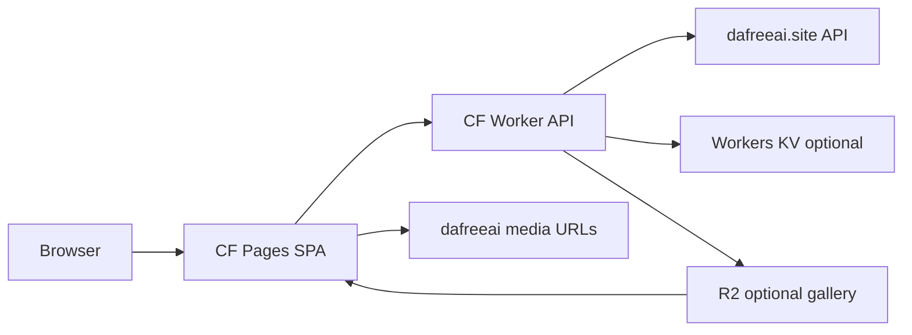
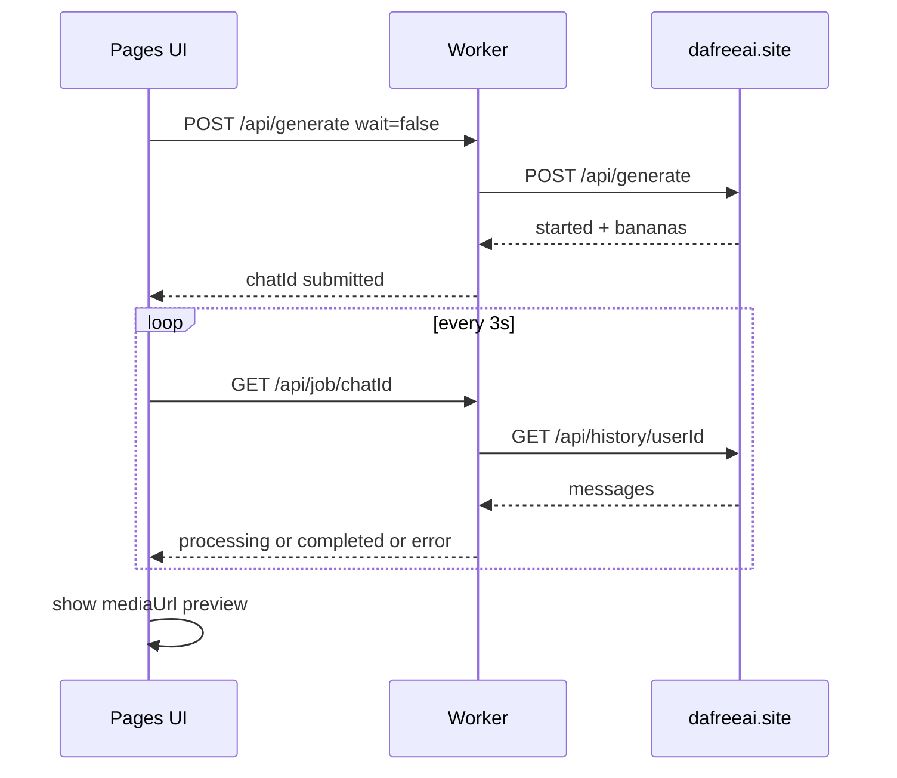

# DaFreeAi Studio — Cloudflare 原生部署方案

> 目標：純 Cloudflare（Workers + Pages），無本機 Flask / 無 VPS  
> 網域：自有域名綁定 Cloudflare  
> 現況基準：本機 Flask UI 已可生成；API 契約見 `API.md` / `dafreeai/client.py`

---

## 1. 為什麼不能直接把 Flask 丟上 CF

| 現況（Flask） | Cloudflare 限制 | 影響 |
|---|---|---|
| Python + Flask 長連線輪詢 | Workers 無 Python runtime（需 JS/TS） | 後端必須重寫 |
| `dafreeai_user.json` 寫本機檔 | Workers 無持久本機磁碟 | 憑證改存瀏覽器 / KV / Cookie |
| `output/` 本機下載 | 無本機檔案系統 | 改遠端 URL 或 R2 |
| `wait_for_result` 阻塞 180s | Worker CPU/wall time 有限 | 必須非阻塞：提交 + 前端輪詢 |

**結論：採用「Pages 前端 + Workers API 代理」重寫，保留現有 UI 體驗與 API 契約。**

---

## 2. 推薦架構（方案 A 定稿）



### 角色分工

| 元件 | 職責 |
|---|---|
| **Cloudflare Pages** | 靜態前端（`index.html` / CSS / JS），自有域名 `studio.example.com` |
| **Cloudflare Worker** | BFF：代理 generate / history / status / auth；組 settings；錯誤正規化 |
| **Browser localStorage** | 存 `userId` + `token`（預設，最簡） |
| **Workers KV（可選）** | 伺服器端 session / 限流 / 模型快取 |
| **R2（可選 Phase 2）** | 永久作品庫（下載遠端圖後存 R2） |

### 建議網域

| 用途 | 建議 hostname |
|---|---|
| 前端 Pages | `studio.你的域名.com` 或 `ai.你的域名.com` |
| API Worker | 同域路徑 `studio.你的域名.com/api/*`（**推薦**，免 CORS） |
| 或獨立 API | `api.你的域名.com`（需 CORS） |

**強烈建議：Pages + Worker 同域（Pages Functions 或 Worker route `/api/*`），前端 `fetch('/api/...')` 零 CORS。**

---

## 3. 兩種 CF 落地形態（擇一）

### 形態 1（推薦）：Pages + Pages Functions

```
cf-studio/
  public/                 # 前端靜態
    index.html
    css/style.css
    js/app.js
  functions/              # Pages Functions = Worker
    api/[[path]].ts       # 或拆 routes
  shared/
    client.ts
    models.ts
  wrangler.toml / package.json
```

- 一個專案、一次 `wrangler pages deploy`
- 自訂網域綁在 Pages project
- `/api/*` 自動走 Functions

### 形態 2：獨立 Worker + Pages

- Pages 只放靜態
- Worker 綁 `api.domain.com` 或 Pages 自訂 domain 的 route
- 適合 API 要獨立擴充 / 多前端共用

**本方案預設形態 1。**

---

## 4. 認證與安全設計（關鍵）

### 4.1 Token 存放（預設）

```
Browser localStorage:
  dafreeai_user = { id, token, username, ... }
```

- 前端每次呼叫自家 `/api/*` 時，在 JSON body 或 header 帶上憑證
- Worker **不**把 token 寫入永久伺服器檔案
- 與現有「貼上 localStorage JSON」流程一致

建議 header（比 body 乾淨）：

```
X-User-Id: 1266...
X-User-Token: 20fef2...
```

或加密 Cookie（進階）：

- Worker 用 `SESSION_SECRET` 簽 HMAC cookie
- 前端只打 cookie，不暴露 token 給 JS（需 HttpOnly 流程改造）

### 4.2 Worker 代理原則

1. **只允許**轉發到 `https://www.dafreeai.site`
2. 剝離/覆寫危險 header
3. 不把完整 token 寫進 logs
4. 可選：`ALLOWED_ORIGINS` 白名單（同域時可簡化）
5. 可選：簡易 rate limit（KV + IP）

### 4.3 不要做的事

- 不要把 `dafreeai_user.json` 的 token 寫進 repo / Worker secrets 當「全站共用帳號」
- 不要在公開站讓所有訪客共用你的 Discord session
- 若要「私人工具」，加 **Access 保護**（見 §8）

---

## 5. API 對照（Flask → Worker）

| 前端現用路徑 | Worker 行為 | 上游 dafreeai |
|---|---|---|
| `GET /api/meta` | 回傳 models/aspects/qualities（靜態 catalog）+ auth 狀態 | 無或可選 credits |
| `GET /api/auth/login-url` | 代理 | `GET /api/auth/discord/url` |
| `POST /api/auth/exchange` | 代理 code 交換；**回傳 user 給前端存 localStorage**（不寫檔） | `POST /api/auth/discord/callback` |
| `POST /api/auth/save` | 僅驗證 JSON 格式，回 ok（實際存前端） | 無 |
| `GET /api/auth/me` | 用 header 憑證查 balance/tag | bananas + check-tag |
| `POST /api/auth/accept-terms` | 代理 | `POST /api/terms/accept` |
| `GET /api/status` | 聚合 credits/balance/tag/active | 多端點 |
| `GET /api/history` | 代理 + 正規化 rows（含 error 欄位） | `GET /api/history/:userId` |
| `DELETE /api/history/:id` | 代理 | `DELETE /api/history/:userId/:chatId` |
| `POST /api/generate` | 組 settings、提交；**wait=false 預設** | `POST /api/generate` |
| `GET /api/job/:chatId` | 查 history 找結果（含 error 欄位） | history |
| `POST /api/download` | Phase1：回遠端 URL；Phase2：抓圖存 R2 | media URL |
| `GET /api/gallery` | Phase1：空或 localStorage 清單；Phase2：R2 list | R2 |

### 生成流程（與已修好的本機 UI 一致）



---

## 6. 前端改造點（相對現有 static/）

現有 [`static/js/app.js`](I:/新增資料夾 (2)/dafreeai-studio/static/js/app.js) 幾乎可複用，需改：

1. **Auth 持久化**  
   - `save` 不再依賴伺服器檔案  
   - 改 `localStorage.setItem('dafreeai_user', ...)`  
   - 每次 `api()` 自動附加 `X-User-Id` / `X-User-Token`

2. **下載 / 作品庫**  
   - Phase 1：`autoDownload` 改為「開遠端 URL / 瀏覽器下載」  
   - 移除對 `/output/*` 的依賴  
   - Phase 2：接 R2 gallery API

3. **環境**  
   - 同域部署：`api('/api/...')` 不用改 base URL  
   - 若 API 獨立子域：加 `const API_BASE = 'https://api....'`

4. **UI 文案**  
   - 去掉「本機 output 路徑」顯示  
   - 標示「憑證僅存瀏覽器」

---

## 7. Worker 模組設計

```
shared/
  models.ts          # 從 Python models.py 移植 12 模型 + buildSettings
  client.ts          # fetch wrapper → dafreeai.site
  history.ts         # findResultInHistory（含 error 欄位修復）
  auth.ts            # extract headers / body credentials
  types.ts

functions/
  api/meta.ts
  api/auth/*.ts
  api/generate.ts
  api/job/[chatId].ts
  api/history.ts
  api/status.ts
  api/download.ts    # optional
  api/gallery.ts     # optional R2
```

### `client.ts` 核心

```ts
const BASE = "https://www.dafreeai.site";

export async function dfFetch(path: string, init: RequestInit = {}) {
  const res = await fetch(`${BASE}${path}`, {
    ...init,
    headers: {
      "Content-Type": "application/json",
      Accept: "application/json",
      ...(init.headers || {}),
    },
  });
  const data = await res.json().catch(() => ({ raw: await res.text() }));
  if (!res.ok) {
    throw new Error(data?.error || data?.message || `HTTP ${res.status}`);
  }
  return data;
}
```

### 錯誤正規化（必須移植本機修復）

History bot message：

- `error` 字串存在 → `status: "error"`（即使沒有 `isError`）
- `image` / `outputImages` 且非 `placeholder-*` → `completed`
- `isLoading: true` → `processing`

---

## 8. 自有域名綁定步驟

### 前置

1. 域名 NS 已切到 Cloudflare
2. Cloudflare 帳號可建立 Pages / Workers

### 綁定流程

1. 建立 Pages project：`dafreeai-studio`
2. 部署後取得 `xxx.pages.dev`
3. Pages → Custom domains → 加 `studio.你的域名.com`
4. CF 自動加 CNAME / 代理（橘雲）
5. SSL：Full (strict) 即可（Pages 原生 HTTPS）
6. （可選）Cloudflare Access：
   - 應用保護 `studio.你的域名.com`
   - 僅允許你的 Email / OTP / GitHub
   - **強烈建議私人工具開啟**，避免 token 被他人濫用

### DNS 示意

| Type | Name | Target | Proxy |
|---|---|---|---|
| CNAME | studio | `dafreeai-studio.pages.dev` | Proxied |

---

## 9. 環境變數 / Secrets

| Name | 用途 | 必填 |
|---|---|---|
| `DAFREEAI_BASE_URL` | 預設 `https://www.dafreeai.site` | 否 |
| `SESSION_SECRET` | 若用簽章 Cookie | 進階 |
| `ALLOWED_ORIGINS` | CORS 白名單 | 獨立 API 時 |
| `R2` binding | 作品庫 | Phase 2 |
| `KV` binding | 限流 / session | 可選 |

**不要**把個人 Discord token 設成全域 Secret 當全站帳號。

---

## 10. 分階段交付

### Phase 1 — MVP（建議先做）

- [ ] 移植 `models.ts` + `client.ts` + `history.ts`
- [ ] Pages Functions 實作 meta / auth / status / history / generate / job
- [ ] 前端改 localStorage 憑證 + header 注入
- [ ] 預覽用遠端 `mediaUrl`（不存 R2）
- [ ] 部署到 `*.pages.dev` 驗證
- [ ] 綁自有域名 +（建議）Access

**完成標準：** 瀏覽器登入 JSON → 生成 lite/gpt-image → 輪詢完成 → 預覽圖

### Phase 2 — 作品庫

- [ ] R2 bucket `dafreeai-gallery`
- [ ] `POST /api/download` 抓遠端媒體寫入 R2
- [ ] `GET /api/gallery` 列檔
- [ ] 公開或簽名 URL 預覽

### Phase 3 — 強化

- [ ] KV rate limit
- [ ] Access / 簡易密碼門
- [ ] 結構化 logging（不含 token）
- [ ] CI：GitHub → Cloudflare Pages 自動部署

---

## 11. 專案目錄建議（新建 `cf/` 子目錄，不動本機 Flask）

```
dafreeai-studio/
  dafreeai/              # 既有 Python CLI（保留）
  app.py                 # 既有本機 Flask（保留）
  static/                # 既有本機前端（保留）
  cf/                    # 新增 Cloudflare 專案
    package.json
    wrangler.toml
    public/
      index.html
      css/style.css
      js/app.js
    functions/
      api/...
    shared/
      models.ts
      client.ts
      history.ts
    README.md
  plans/
    cloudflare-native-deploy.md
```

本機 Flask 與 CF 版可並存：CLI 繼續本機用，UI 上雲。

---

## 12. 部署指令草案

```bash
cd cf
npm i -D wrangler
npx wrangler pages project create dafreeai-studio
# 開發
npx wrangler pages dev public --compatibility-date=2024-11-01
# 部署
npx wrangler pages deploy public --project-name=dafreeai-studio
```

Functions 放在 `functions/` 時，Pages 會自動綁定。

自訂網域在 Dashboard 點選即可；CLI 也可用：

```bash
npx wrangler pages domain add studio.你的域名.com --project-name=dafreeai-studio
```

---

## 13. 風險與對策

| 風險 | 對策 |
|---|---|
| dafreeai 限流 / `Generation in progress` | UI 顯示明確錯誤；job 輪詢；避免連點 |
| `MODEL_NOT_ALLOWED_ON_UNLIMITED_PACKAGE` | 模型 catalog 標註 unlimited/tag；錯誤即時顯示 |
| OAuth code 單次失效 | 主推 localStorage JSON 貼上 |
| Token 外洩 | Access 鎖站；HTTPS；不 log token；可改 HttpOnly cookie |
| Worker 逾時 | 禁止伺服器端長 wait；前端輪詢 |
| CORS / 混合內容 | 同域 `/api` + 全站 HTTPS |
| 上游改 API | 集中 `client.ts`；保留本機 Python 作對照 |

---

## 14. 與本機版功能對照

| 功能 | 本機 Flask | CF Phase 1 | CF Phase 2 |
|---|---|---|---|
| 登入 JSON / OAuth | ✅ 寫檔 | ✅ localStorage | ✅ |
| 生成 + 輪詢 | ✅ | ✅ | ✅ |
| 歷史 / 刪除 | ✅ | ✅ | ✅ |
| 狀態 / 餘額 / tag | ✅ | ✅ | ✅ |
| 本機 output 下載 | ✅ | ❌ → 遠端 URL | R2 |
| 作品庫 | 本機 gallery | 簡化 | R2 gallery |
| CLI | ✅ | 不影響 | 不影響 |

---

## 15. 建議決策（請你確認）

1. **子網域名稱**：`studio.` / `ai.` / 其他？
2. **作品庫**：Phase 1 只要遠端 URL，還是一開始就上 R2？
3. **站點保護**：是否啟用 Cloudflare Access（私人工具強烈建議）？
4. **實作範圍**：先做 Phase 1 MVP 部署到你的域名？

確認後切換 **Code 模式**，在 `cf/` 建立 Pages + Functions 並部署。
